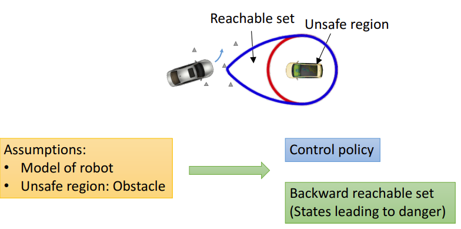
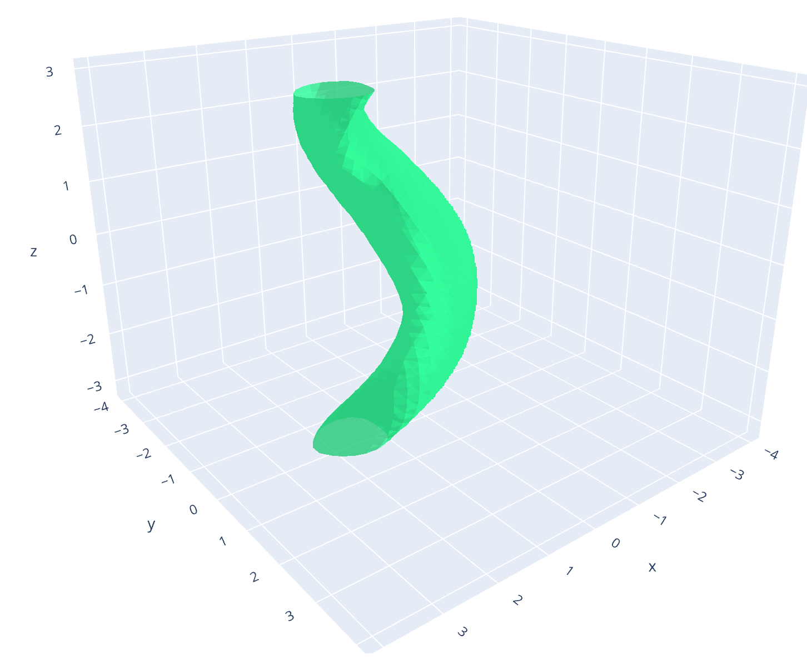

# Optimized Dynamic Programming-Based Algorithms Solver (OptimizedDP)
The repo contains implementation of dynamic programming based algorithms in optimal control. Specifically, the solver supports 3 main classes of algorithms: level set based algorithm for solving Hamilton-Jacobi-Issac (HJI) partial differential equation (PDE) arising in reachability analysis and differential games [1], time-to-reach (TTR) computations of dynamical systems in reachability analysis [2], and value-iterations algorithm for solving continuous state-space action-space Markov Decision Process (MDP). All these algorithms share the property of being implemented on a multidimensional grid and hence, their computational complexities increase exponentially as a function of dimension. For all the aforementioned algorithms, our toolbox allows computation up to 6 dimensions, which we think is the limit of dynammic programming on most modern personal computers.
<div align="center">
    
</div>        

<!--  -->

In comparison with previous works, our toolbox strives to be both efficient in implementation while being user-friendly. This is reflected in our choice of having Python as a language for initializing problems and having python-like HeteroCL [3] language for the core algorithms implementation and dynamical systems specification. Our implementation is 7-32x faster than the [Level Set Toolbox](https://github.com/risk-sensitive-reachability/ToolboxLS) and [HelperOC](https://github.com/HJReachability/helperOC) and 2-3x faster than [BEACLS](https://hjreachability.github.io/beacls/) implementation in C++. Please find more details about using the repo for solving your problems in this page, and should you have any questions/problems/requests please direct the messages to Minh Bui at buiminhb@sfu.ca 

# Quickstart (Ubuntu 18, 20, 22)
Please install the following:
* Install Anaconda (https://docs.anaconda.com/anaconda/install/linux/)
* Create a virtual environemnt using the provided `environment.yml`

    ``` conda env create -f environment.yml ```
    
* Install the `optimized_dp` repository

    ``` pip install -e . ```
* Note: If you're on Ubuntu 20.04 or 22.04, you may have encounter an error regarding ``` libtinfo5 ```. 
  To fix, please just run this command 

    ```sudo apt install libtinfo5 ``` 


# Solving the Hamilton-Jacobi-Issac (HJI) PDE
* We provide a running example of solving HJI PDE in the file [`examples/low_dimensional_plotting_example.py`](https://github.com/SFU-MARS/optimized_dp/examples/examples.py):
```python
# STEP 1: Define grid
grid_min = np.array([-4.0, -4.0, -math.pi])
grid_max = np.array([4.0, 4.0, math.pi])
dims = 3
N = np.array([40, 40, 40])
pd=[2]
g = Grid(grid_min, grid_max, dims, N, pd)

# STEP 2: Generate initial values for grid using shape functions
center = np.zeros(dims)
radius = 1.0
ignore_dims = [2]
Initial_value_f = CylinderShape(g, ignore_dims, center, radius)

# STEP 3: Time length for computations
lookback_length = 2.0
t_step = 0.05

small_number = 1e-5
tau = np.arange(start=0, stop=lookback_length + small_number, step=t_step)

# STEP 4: User-defined System dynamics for computation
sys = DubinsCapture(uMode="max", dMode="min")

po2 = PlotOptions(do_plot=False, plot_type="3d_plot", plotDims=[0,1,2],
                  slicesCut=[])
                  
# STEP 5: Initialize plotting option
po1 = PlotOptions(do_plot=True, plot_type="set", plotDims=[0,1,2])

# STEP 6: Call HJSolver function (BRS)
compMethod = { "TargetSetMode": "None"}
result_3 = HJSolver(sys, g, Initial_value_f, tau, compMethod, po1, saveAllTimeSteps=True)
```
* To run the example, execute the command `python3 low_dimensional_plotting_example.py`
* If the parameter `do_plot` is set to `True`, when initializing `PlotOptions`. The parameter `saveAllTimeSteps` is set to `False` in `HJSolver`, an static 3D plot will show on pop-up browser.
<!--  -->
<div align="center">

</div>        

* If interactive 3D animation needs to be visualized, and outputs need to be saved locally
```python
# While file needs to be saved locally, set save_fig=True and filename, recommend to set interactive_html=True for better interaction
po2 = PlotOptions(do_plot=False, plot_type="set", plotDims=[0,1,2],
                  slicesCut=[], colorscale="Bluered", save_fig=True, filename="plots/3D_0_sublevel_set.png", interactive_html=False)

# STEP 7: Visualizing output
plot_isosurface(g, result_3, po2)
```

<!-- * Check the interactive result [`images/3D_0_sublevel_set.html`](https://github.com/SFU-MARS/optimized_dp/images/3D_0_sublevel_set.html) -->


* For computing result higher than 6D, check [`examples/examples.py`](https://github.com/SFU-MARS/optimized_dp/examples/examples.py)
* Notes: For 6 dimensions, recommended grid size is 20-30 each dimension on system with 32Gbs of DRAM.
* Create a class file in folder dynamics/ to specify your own system dynamics. Remember to import the class in your running example.  

## System dynamics specification
It can noticed in ```user_definer.py``` that the class DubinsCapture is imported from the folder ```dynamics/```, where our example system dynamics. 
```python 
import heterocl as hcl

class DubinsCapture:
    def __init__(self, x=[0,0,0], wMax=1.0, speed=1.0, dMax=1.0, uMode="max", dMode="min"):
        self.x = x
        (...)
        self.dMode = dMode

    def opt_ctrl(self, t, state, spat_deriv):
        """
                :param  spat_deriv: tuple of spatial derivative in all dimensions
                        state: x1, x2, x3
                        t: time
                :return: a tuple of optimal disturbances
        """

        (...)
        return (opt_w[0], in3[0], in4[0])

    def opt_dstb(self, t, state, spat_deriv):
        """
            :param spat_deriv: tuple of spatial derivative in all dimensions
                    state: x1, x2, x3
                    t: time
            :return: a tuple of optimal disturbances
        """
        (...)        
        return (d1[0], d2[0], d3[0])

    def dynamics(self, t, state, uOpt, dOpt):
        (...)
        return (x_dot[0], y_dot[0], theta_dot[0])
``` 


# Time-to-Reach computation
* We have provided an example in [`examples/TTR_example.py`](https://github.com/SFU-MARS/optimized_dp/examples/TTR_example.py):
```python
# -------------------------------- ONE-SHOT TTR COMPUTATION ---------------------------------- #
g = Grid(minBounds=np.array([-3.0, -1.0, -math.pi]), maxBounds=np.array([3.0, 4.0, math.pi]),
         dims=3, pts_each_dim=np.array([50, 50, 50]), periodicDims=[2])
# Car is trying to reach the target
my_car = DubinsCar(uMode="min")

# Initialize target set as a cylinder
targetSet = CylinderShape(g, [2], np.array([0.0, 1.0, 0.0]), 0.70)
po = PlotOptions( "3d_plot", plotDims=[0,1,2], slicesCut=[],
                  min_isosurface=lookback_length, max_isosurface=lookback_length)

# Convergence threshold
epsilon = 0.001
V_0 = TTRSolver(my_car, g, targetSet, epsilon, po)
```
* To run the example : `python3 TTR_example.py`
# Current code structure
* solver.py: Containing python APIs to interact with the numerical solver
* dynamics/ : User's dynamical system specification
* Shapes/ShapesFunctions.py : Add-in functions for initializing different shapes/intial value functions
* computeGraphs/CustomGraphFunctions.py: Ready-to-user HeteroCL style utility functions

### Paper and Citation (Bibtex)  
Please cite our paper (https://arxiv.org/abs/2204.05520) if you use the toolbox in your research:
```
@misc{https://doi.org/10.48550/arxiv.2204.05520,
  doi = {10.48550/ARXIV.2204.05520},
  url = {https://arxiv.org/abs/2204.05520},
  author = {Bui, Minh and Giovanis, George and Chen, Mo and Shriraman, Arrvindh},
  keywords = {Systems and Control (eess.SY), FOS: Electrical engineering, electronic engineering, information engineering, FOS: Electrical engineering, electronic engineering, information engineering},
  title = {OptimizedDP: An Efficient, User-friendly Library For Optimal Control and Dynamic Programming},
  publisher = {arXiv},
  year = {2022}, 
  copyright = {Creative Commons Attribution 4.0 International}
}
```  


# Related Projects
### MATLAB
* [A Toolbox of Level Set Methods ](https://www.cs.ubc.ca/~mitchell/ToolboxLS/)
* [helperOC](https://github.com/HJReachability/helperOC)
### C++
* [BEACLS](https://hjreachability.github.io/beacls/)
### Python/JAX
* [hj_reachability](https://github.com/StanfordASL/hj_reachability)

# References
[1] "Hamilton–Jacobi Reachability: Some Recent Theoretical Advances and Applications in Unmanned Airspace Management" by Mo Chen and Claire J. Tomlin in 
Annual Review of Control, Robotics, and Autonomous Systems 2018 1:1, 333-358 [pdf](https://sfumars.com/wp-content/papers/2018_ar_hjreach.pdf)

[2] "One-Shot Computation of Reachable Sets for Differential Games" by Insoon Yang [pdf](https://dl.acm.org/doi/pdf/10.1145/2461328.2461359?casa_token=GmZ6JB2DhLwAAAAA:qRSxxQisIcNpNo6nJHWbi5lRSmxFWk_gL2dXxilkpPi3PsgwxwPSs5hCdcuV7Elx1PTQ84cAGFQ)

[3] "HeteroCL: A Multi-Paradigm Programming Infrastructure for Software-Defined Reconfigurable Computing" by Yi-Hsiang Lai [pdf](https://vast.cs.ucla.edu/~chiyuze/pub/fpga19-heterocl.pdf)

