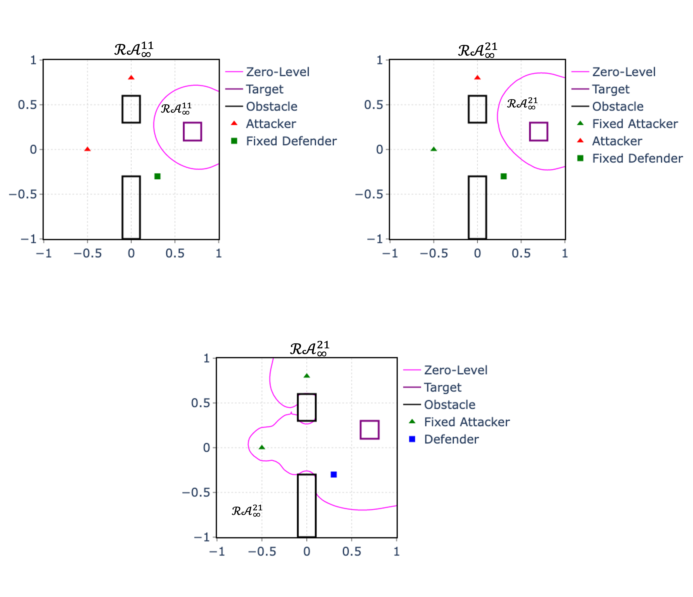

# Multi-Agent Reach-Avoid Games (MARAG)
This repository contains the implementation of the paper "Multi-Agent Reach-Avoid Games: Two Attackers Versus One Defender and Mixed Integer Programming (2023 CDC accepted)". This implementation is based on the [OptimizedDP library](https://github.com/SFU-MARS/optimized_dp) developed by the MARS lab, Simon Fraser University.

# Details to Reimplement
## Step 1: Set Dynamics
The dynamics of attackers and defenders (including the maximum speed) in different reach-avoid games are in files ``AttackerDefender1v0.py``, ``AttackerDefender1v1.py`` and ``AttackerDefender2v1.py``. 

## Step 2: Generate Value Functions
We need to calculate several value functions for the further reach-avoid games.
* Run the file ``MRAG/hjvalue1v0.py`` to obtain the 1 vs. 0 value function ``1v0AttackDefend.npy``, which is used to generate control inputs of attackers.
* Run the file ``MRAG/hjvalue1v1.py`` to generate the value fucnton ``1v1AttackDefend_speed15.npy``, which is used to generate control inputs of the defender in the 1 vs. 1 reach-avoid game.
* Run the file ``MRAG/hjvalue1v1_basement.py`` to generate the value fucntion ``1v1AttackDefend_g30_speed15.npy`` for the computation of the 2 vs. 1 value function.
* Run the file ``MRAG/hjvalue2v1.py`` to generate the value function ``2v1AttackDefend_speed15.npy``, which is used to generate control inputs of the defender. This procedure will take about 1.5 hours and consume around 20 gigabytes of RAM (tested on a 16-thread Intel(R) Core(TM) i9-9900K CPU at 3.60GHz). 

So far, all necessarcy value functions are calculated.

## Step 3: Run the Games
### 3.1 Reach-Avoid Set Visualization
Run the file ``MRAG/plot_figures.py`` to obtain the figures of reach-avoid set ``2v1_RAS.png``. 

<div align="center">
    
</div>        

<!--  -->

### 3.2 The 2 vs. 1 Reach-Avoid Game Simulation
* Run the file ``MRAG/game2v1.py`` to obtain the results of our proposed method. To get the positions of different time instances, change the corresponding setting of the total game duration T:
``` python
T = 0.785 # attackers_stop_times = [0.475s (95 A1 is captured), 0.69s (138 A0 by D0)]
```
* Run the file ``MRAG/game2v1_basement.py`` to obtain the results of the baseline method. To get the positions of different time instances, change the corresponding setting of the total game duration T:
```python
T = 0.785 # total simulation time T = [0.53s (106 A0 by D0) ,0.785s(156 A1 arrives)]
```

### 3.3 The 6 vs. 2 Reach-Avoid Game Simulation
* Run the file ``MRAG/game6v2.py`` to obtain the results of our proposed method. To get the positions of different time instances, change the corresponding setting of the total game duration T.

* Run the file ``MRAG/game6v2_basement.py`` to obtain the results of the baseline method. To get the positions of different time instances, change the corresponding setting of the total game duration T.

### 3.4 The 8 vs. 4 Reach-Avoid Game Simulation
* Run the file ``MRAG/game8v4.py`` to obtain the results of our proposed method. To get the positions of different time instances, change the corresponding setting of the total game duration T.

* Run the file ``MRAG/game8v4_basement.py`` to obtain the results of the baseline method. To get the positions of different time instances, change the corresponding setting of the total game duration T.
